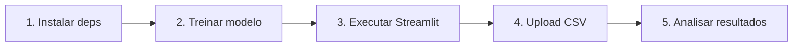

# 🚀 GUIA DE EXECUÇÃO DO PROJETO

## 📋 Pré-requisitos

1. ✅ Python 3.10+ instalado
2. ✅ Ambiente virtual ativado
3. ✅ Dependências instaladas

---

## 🔧 Passo a Passo Completo

### **1️⃣ Ativar Ambiente Virtual**

```bash
# Se ainda não criou o ambiente virtual:
python -m venv .venv

# Ativar (Windows - Git Bash):
source .venv/Scripts/activate

# Ativar (Windows - CMD):
.venv\Scripts\activate.bat

# Ativar (Windows - PowerShell):
.venv\Scripts\Activate.ps1

# Ativar (Linux/Mac):
source .venv/bin/activate
```

### **2️⃣ Instalar Dependências**

```bash
# Instalar todas as dependências necessárias
pip install -r requirements.txt

# Se quiser trabalhar com Jupyter também:
pip install -r requirements-jupyter.txt
```

### **3️⃣ Treinar o Modelo (IMPORTANTE!)**

**⚠️ Este é o passo que estava faltando!**

```bash
python train_model.py
```

**O que este script faz:**
- ✅ Carrega o dataset `UCI_Credit_Card.csv`
- ✅ Limpa e prepara os dados
- ✅ Treina um modelo Random Forest
- ✅ Avalia o modelo (métricas, ROC-AUC)
- ✅ Salva o modelo em `modelo_credito.pkl`
- ✅ Gera gráficos de avaliação

**Saída esperada:**
```
📊 Carregando dados...
✅ Dados carregados: 30000 linhas, 25 colunas
🧹 Limpando dados...
✅ Train set: 24000 amostras
✅ Test set: 6000 amostras
🚀 Iniciando treinamento...
✅ Treinamento concluído!
📈 Avaliando modelo...
💾 Salvando modelo em 'modelo_credito.pkl'...
✅ PROCESSO CONCLUÍDO COM SUCESSO!
```

### **4️⃣ (Opcional) Configurar Ollama para LLM**

Se quiser usar as explicações com IA:

```bash
# 1. Baixe e instale o Ollama:
# https://ollama.ai/

# 2. Baixe um modelo (exemplo: phi3):
ollama pull phi3:mini

# 3. Inicie o servidor Ollama:
ollama serve
```

**⚠️ Nota:** Se não configurar o Ollama, o app ainda funcionará, mas sem as explicações geradas por IA.

### **5️⃣ Executar a Aplicação Streamlit**

```bash
streamlit run app.py
```

**A aplicação será aberta em:** `http://localhost:8501`

---

## 📂 Arquivos Gerados

Após executar o `train_model.py`, você terá:

```
CreditCard_Risk/
├── modelo_credito.pkl          # ⭐ Modelo treinado (PRINCIPAL)
├── confusion_matrix.png         # 📊 Visualização da matriz de confusão
├── roc_curve.png               # 📈 Curva ROC
└── train_model.py              # 🔧 Script de treinamento
```

---

## 🧪 Testando a Aplicação

### **Opção 1: Usar arquivo de teste**

Crie um arquivo CSV de teste com as mesmas colunas do dataset original:

```python
# Exemplo: criar um arquivo de teste
import pandas as pd

# Carregar dataset original
df = pd.read_csv("UCI_Credit_Card.csv")

# Pegar 100 amostras aleatórias
df_test = df.sample(100, random_state=42)

# Salvar
df_test.to_csv("test_sample.csv", index=False)
```

Depois, faça upload deste arquivo no Streamlit.

### **Opção 2: Usar o dataset completo**

Simplesmente faça upload do arquivo `UCI_Credit_Card.csv` completo.

---

## ❗ Troubleshooting

### **Erro: "modelo_credito.pkl não encontrado"**
**Solução:** Execute `python train_model.py` primeiro!

### **Erro: "ModuleNotFoundError"**
**Solução:** Instale as dependências:
```bash
pip install -r requirements.txt
```

### **Erro no Ollama/LLM**
**Solução:** 
1. Verifique se o Ollama está rodando: `ollama serve`
2. Configure a URL correta em `llm.py` (linha 10)
3. Ou desative as explicações IA (o app funcionará sem elas)

### **Erro: "UCI_Credit_Card.csv não encontrado"**
**Solução:** Baixe o dataset do Kaggle:
https://www.kaggle.com/datasets/uciml/default-of-credit-card-clients-dataset

---

## 🎯 Fluxo Completo de Trabalho



1. ✅ **Instalar dependências** → `pip install -r requirements.txt`
2. ✅ **Treinar modelo** → `python train_model.py`
3. ✅ **Executar app** → `streamlit run app.py`
4. ✅ **Upload dados** → Fazer upload do CSV na interface
5. ✅ **Analisar** → Ajustar threshold, ver explicações

---

## 📚 Estrutura de Comando Resumida

```bash
# Setup inicial (uma vez)
python -m venv .venv
source .venv/Scripts/activate  # Windows Git Bash
pip install -r requirements.txt

# Treinar modelo (necessário uma vez, ou quando atualizar)
python train_model.py

# Executar aplicação (sempre que quiser usar)
streamlit run app.py
```

---

## 🎓 Próximos Passos

Depois que tudo estiver funcionando:

1. 📊 **Explorar o notebook**: `jupyter notebook credit_EDA.ipynb`
2. 🎛️ **Testar diferentes thresholds** no Streamlit
3. 🤖 **Experimentar com o LLM** (se configurou Ollama)
4. 📈 **Analisar features importantes** (SHAP values)
5. 🔧 **Otimizar hiperparâmetros** do modelo

---

## ✅ Checklist Rápido

- [ ] Ambiente virtual ativado
- [ ] Dependências instaladas
- [ ] Dataset `UCI_Credit_Card.csv` presente
- [ ] Modelo treinado (`python train_model.py`)
- [ ] Arquivo `modelo_credito.pkl` existe
- [ ] Streamlit executando (`streamlit run app.py`)
- [ ] (Opcional) Ollama configurado

---

## 🆘 Suporte

Se encontrar problemas:

1. Verifique se seguiu todos os passos na ordem
2. Confirme que o arquivo `modelo_credito.pkl` existe
3. Verifique os logs de erro no terminal
4. Confirme que todas as dependências estão instaladas

**Dica:** Execute `python train_model.py` sempre que atualizar o código do modelo!
