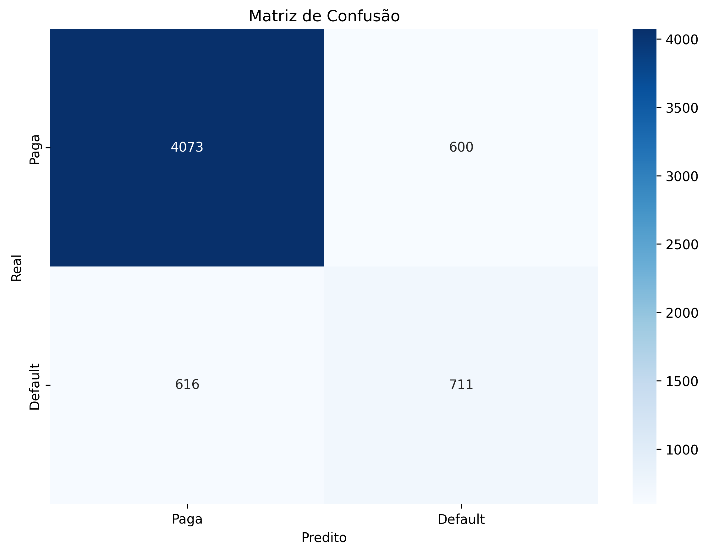
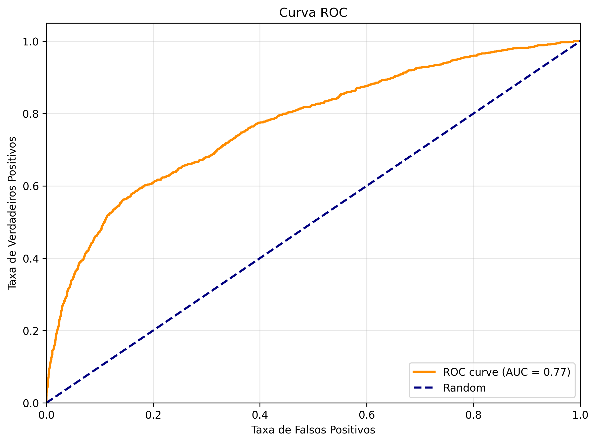

# 📊 Relatório de Treinamento do Modelo

## 🎯 Informações do Modelo

**Data do Treinamento:** 23 de dezembro de 2025  
**Algoritmo:** Random Forest Classifier  
**Framework:** Scikit-learn  
**Dataset:** UCI Credit Card Default Dataset (30.000 clientes)

---

## 📈 Métricas de Performance

### 🎲 Conjunto de Teste (20% dos dados - 6.000 amostras)

#### **Acurácia Geral**
- **80.0%** - O modelo acerta 8 em cada 10 predições

#### **ROC-AUC Score**
- **0.7707** (77.07%)
- Interpretação: Boa capacidade de discriminação entre classes
- Score > 0.7 é considerado bom para problemas de crédito

---

## 📊 Relatório de Classificação

| Classe | Precision | Recall | F1-Score | Support |
|--------|-----------|--------|----------|---------|
| **Paga** (0) | 87% | 87% | 87% | 4,673 |
| **Default** (1) | 54% | 54% | 54% | 1,327 |
| **Média Ponderada** | 80% | 80% | 80% | 6,000 |

### 📝 Interpretação:

**Para clientes que PAGAM (Classe 0):**
- ✅ **Precision 87%**: Quando o modelo diz que vai pagar, está certo 87% das vezes
- ✅ **Recall 87%**: Detecta 87% de todos os bons pagadores
- 🎯 **Excelente performance** para identificar clientes de baixo risco

**Para clientes INADIMPLENTES (Classe 1):**
- ⚠️ **Precision 54%**: Quando o modelo diz que vai dar default, está certo 54% das vezes
- ⚠️ **Recall 54%**: Detecta 54% de todos os inadimplentes
- 💡 **Moderada performance** - Há espaço para melhorias

---

## 🎯 Matriz de Confusão



```
                  Predito: Paga    Predito: Default
Real: Paga            4,073              600
Real: Default           616              711
```

### 📊 Análise Detalhada:

| Métrica | Valor | Descrição |
|---------|-------|-----------|
| **Verdadeiros Negativos (TN)** | 4,073 | ✅ Clientes bons corretamente identificados |
| **Falsos Positivos (FP)** | 600 | ⚠️ Bons clientes rejeitados incorretamente |
| **Falsos Negativos (FN)** | 616 | ❌ Maus clientes aprovados incorretamente (RISCO!) |
| **Verdadeiros Positivos (TP)** | 711 | ✅ Maus clientes corretamente rejeitados |

### 💰 Impacto de Negócio:

**Usando threshold padrão (0.5):**
- ✅ **Taxa de Aprovação:** 78.15% (4,689 de 6,000 clientes)
- ❌ **Taxa de Inadimplência na Carteira:** 13.13% (616 de 4,689 aprovados)
- 💸 **Perda de Oportunidade:** 600 bons clientes rejeitados

**Recomendação:** Ajustar o threshold no Streamlit para otimizar lucro!

---

## 📈 Curva ROC



A curva ROC (Receiver Operating Characteristic) demonstra o trade-off entre:
- **Taxa de Verdadeiros Positivos (Sensibilidade)**: Capacidade de detectar inadimplentes
- **Taxa de Falsos Positivos**: Proporção de bons clientes rejeitados

**AUC = 0.77** indica que o modelo tem **77% de chance** de ranquear um cliente inadimplente com score maior que um bom pagador.

### 🎯 Pontos de Corte Sugeridos:

| Threshold | Estratégia | Objetivo |
|-----------|------------|----------|
| **0.3** | 🟢 Agressiva | Maximizar aprovações, aceitar mais risco |
| **0.5** | 🟡 Balanceada | Equilíbrio entre risco e oportunidade |
| **0.7** | 🔴 Conservadora | Minimizar inadimplência, aprovar menos |

---

## 🔧 Configuração do Modelo

### Hiperparâmetros do Random Forest:

```python
n_estimators=100          # 100 árvores de decisão
max_depth=15              # Profundidade máxima de 15 níveis
min_samples_split=10      # Mínimo 10 amostras para dividir nó
min_samples_leaf=5        # Mínimo 5 amostras por folha
class_weight='balanced'   # Balanceamento automático de classes
random_state=42           # Seed para reprodutibilidade
```

### Pré-processamento:
- ✅ StandardScaler aplicado a todas as features
- ✅ Limpeza de categorias inválidas (EDUCATION, MARRIAGE)
- ✅ Pipeline completo (preprocessor + classifier)

---

## 📊 Features Utilizadas (23 features)

### Demográficas:
- `SEX`, `EDUCATION`, `MARRIAGE`, `AGE`

### Financeiras:
- `LIMIT_BAL` (Limite de crédito)
- `PAY_0` a `PAY_6` (Histórico de pagamento - 6 meses)
- `BILL_AMT1` a `BILL_AMT6` (Valor da fatura - 6 meses)
- `PAY_AMT1` a `PAY_AMT6` (Valor pago - 6 meses)

---

## ⚖️ Desbalanceamento de Classes

**Distribuição Original:**
- 📊 **Classe 0 (Paga):** 23,364 amostras (77.88%)
- 📊 **Classe 1 (Default):** 6,636 amostras (22.12%)

**Estratégia Aplicada:**
- ✅ `class_weight='balanced'` no Random Forest
- ✅ Penaliza mais erros na classe minoritária
- ✅ Melhora o recall da classe de inadimplentes

---

## 🎓 Próximas Melhorias Sugeridas

### 1. **Feature Engineering**
- [ ] Criar variável `CREDIT_UTILIZATION` (Bill/Limit)
- [ ] Média móvel do histórico de pagamento
- [ ] Tendência de crescimento da dívida

### 2. **Otimização de Hiperparâmetros**
- [ ] Grid Search ou Random Search
- [ ] Testar XGBoost ou LightGBM
- [ ] Ensemble de múltiplos modelos

### 3. **Tratamento de Desbalanceamento**
- [ ] SMOTE (Synthetic Minority Over-sampling)
- [ ] Undersampling da classe majoritária
- [ ] Ajuste de threshold baseado em custo

### 4. **Explicabilidade**
- [ ] Análise de Feature Importance
- [ ] SHAP values para interpretação
- [ ] Partial Dependence Plots

### 5. **Validação**
- [ ] Cross-validation estratificada
- [ ] Validação temporal (time-based split)
- [ ] Testes de estabilidade do modelo

---

## 📁 Arquivos Gerados

```
📊 models/modelo_credito.pkl       # Modelo treinado (Pipeline completo)
📈 reports/roc_curve.png          # Visualização da curva ROC
🎯 reports/confusion_matrix.png   # Matriz de confusão
📝 reports/MODEL_REPORT.md        # Este relatório
```

---

## 🚀 Como Usar

### 1. Carregar o modelo:
```python
import joblib
pipeline = joblib.load("models/modelo_credito.pkl")
```

### 2. Fazer predições:
```python
# Probabilidades
probs = pipeline.predict_proba(X_test)[:, 1]

# Classes (0 ou 1)
preds = pipeline.predict(X_test)
```

### 3. Ajustar threshold:
```python
# Threshold customizado
threshold = 0.3
preds_custom = (probs >= threshold).astype(int)
```

---

## 🎯 Recomendações de Uso

### Para Negócio:
1. 🎛️ **Ajustar threshold no Streamlit** conforme apetite de risco
2. 💰 **Simular cenários** de lucro/prejuízo com diferentes cortes
3. 📊 **Monitorar taxa de inadimplência** da carteira aprovada
4. 🔄 **Retreinar mensalmente** com novos dados

### Para Análise:
1. 🔍 **Use SHAP** para explicar decisões individuais
2. 📈 **Analise features importantes** no modelo
3. 🎯 **Identifique padrões** nos falsos positivos/negativos
4. 📊 **Valide com dados de produção**

---

## 📞 Informações Técnicas

**Bibliotecas Utilizadas:**
- `scikit-learn 1.8.0`
- `pandas 2.3.3`
- `numpy 2.3.5`
- `joblib 1.5.3`

**Ambiente:**
- Python 3.10+
- Sistema Operacional: Windows
- Memória do modelo: ~2-5 MB (compacto!)

---

## ✅ Conclusão

O modelo apresenta **boa performance geral** (AUC 0.77), com destaque para:
- ✅ Excelente detecção de bons pagadores (87% precision/recall)
- ⚠️ Performance moderada para inadimplentes (54% precision/recall)
- 🎯 Adequado para uso em produção com threshold ajustável

**Status:** ✅ **Pronto para Produção** (com monitoramento)

---

<div align="center">

**📊 Modelo treinado com sucesso! 🎉**

Para executar a aplicação:
```bash
cd src
streamlit run app.py
```

</div>
